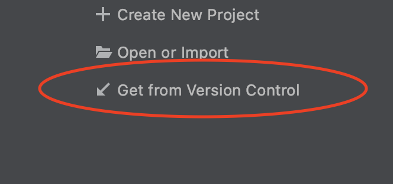

# City Super Mod
The City Super Mod is a mod for Minecraft 1.12.2 that brings a number of blocks and items to help build your Minecraft city. Initially, the mod was built for the City of MCLA (now City of Alto), but will soon become publicly available as source-code and a compiled mod.

## Information and Documentation
Information and documentation for the City Super Mod is available on the [City Super Mod Wiki](https://git.micatechnologies.com/minecraft/city-super-mod/-/wikis/home). This documentation is currently under development, and at this time, may be incomplete or incorrect. 

## Issues
Having an issue with the mod? Error in the documentation or it just isn't clear enough? Let us know by using the GitLab issue tracker, available in the menu or by [clicking here](https://git.micatechnologies.com/minecraft/city-super-mod/-/issues).

## Team
Contributions and modifications are not limited to the development team, and it is encouraged to file issues and create merge requests.

 
**Name:** Alex 
**Git:** ah 
**Minecraft:** HawkA97
 
 

 
**Name:** Brandon
 
**Git:** bh
 
**Minecraft:** ThatCrazyPandog

## Development
### IDE/Making Changes
The preferred development environment/IDE for the City Super Mod is [IntelliJ IDEA](https://www.jetbrains.com/idea/download). 
After opening IntelliJ, choose the option "Get from Version Control", which allows you to download and open an IntelliJ project from a Git server.

### Contributing Code/Changes
To contribute code, you will need to push your modifications to the Git server on a new branch. 
To protect the working code, modification of the `master` branch is not permitted except through merge request. 
After you submit a merge request, the development team will need to review and approve your modifications/contributions before they can be merged.

To learn more about using Git integration with the IntelliJ IDEA IDE, please see [https://www.jetbrains.com/help/idea/using-git-integration.html](https://www.jetbrains.com/help/idea/using-git-integration.html).

To learn more about the version control system Git, please see [https://git-scm.com/doc](https://git-scm.com/doc).

## Credits
Development and code for the City Super Mod began with [Pylo MCreator](https://mcreator.net). 
Current development is performed with the JetBrains IntelliJ IDEA IDE.

