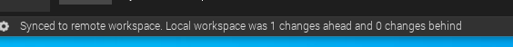
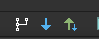

# The MCLA Mod
## Developers
The developers currently are hawka97 (Alex) and rinrincodes (Brandon). For more information, and to contact us, please email mayor@cityofmcla.com

## Development Setup
To edit, modify and view the MCLA Mod, you need to download and install MCreator 2020.1 or later. Open MCreator and click Clone remote. Enter the following Remote Git repository HTTPS URL: `https://github.com/hawka97/csm.git`, then populate your GitHub username and password and click Setup remote workspace. 

## Making Changes and Contributing
In MCreator, before making changes, you need to sync your workspace. Click the blue down arrow in the upper right toolbar. Watch the status bar at the bottom of the screen. If the pull is complete, you will see a message such as "Synced to remote workspace. Local workspace was X changes ahead and X changes behind"

_Blue Down Arrow:_ PULL  
_Green Up and Blue Down Arrow:_ SYNC (PUSH AND PULL)  

  

   

__NOTE:__ It is common for MCreator to not pull the changes. Make sure to verify it pulls the latest changes. The SYNC option usually works better than the PULL option, so the SYNC option is recommended where possible. 
## Credits
The MCLA Mod is developed using MCreator. You can learn more about MCreator by visiting their website, <https://mcreator.net>.

