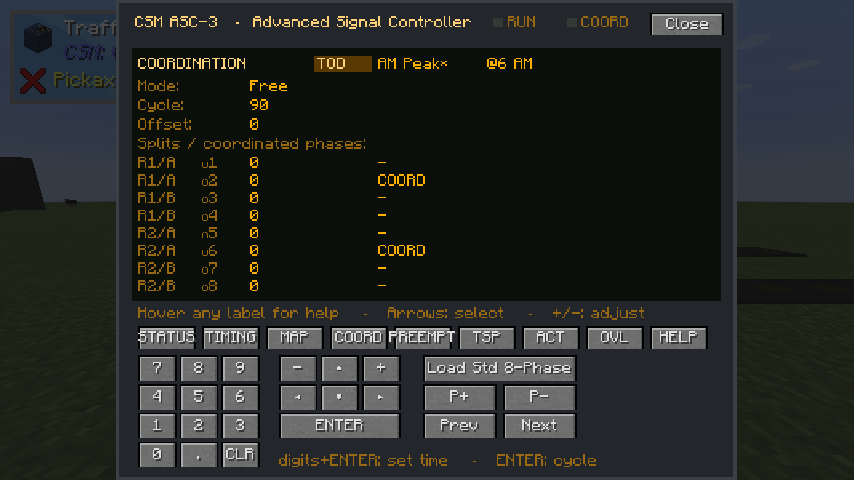
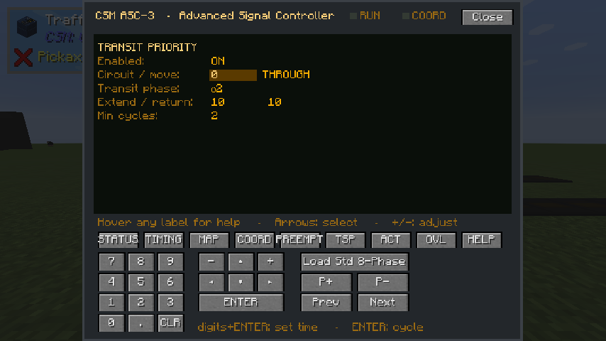

# Advanced Mode (ASC-3)

Normal mode runs a simple two-street alternation. **Advanced mode** replaces it with a NEMA
**dual-ring, dual-barrier** controller modelled on the Econolite ASC/3 — the cabinet a lot of real
American intersections actually run.

Turn it on by setting the controller's mode to **Advanced**, then open the controller's screen to
program it.

!!! info "This is a real phase controller"

    Eight NEMA phases, two rings, barriers between compatible movement groups, per-phase timing,
    recalls, overlaps, preemption and coordination. If you know how an ASC/3 is programmed, this
    will be familiar; if you do not, the defaults run a sane four-way intersection out of the box.

## How it fits together

A **phase** is one movement — say, northbound left. Each phase has:

- a **ring** (1 or 2) and a **barrier**, which together decide what may run alongside it
- a **circuit**, which is the group of signal heads it drives
- a **movement type**: through, left, protected left, right, or pedestrian
- its own **timing**, and a **recall** setting

Two rings run at once, one phase each, and a barrier is the line neither ring may cross until both
are ready. That is what stops opposing lefts running with opposing throughs.

## Leading pedestrian interval (`DLY GRN`)

The ASC/3 calls this **delayed green**: the walk indication starts, vehicles are held a few seconds
so pedestrians can establish themselves in the crosswalk, and only then does the green release.

Set **delayed green** on a phase, in ticks. While it runs:

- vehicles show **red**
- pedestrians show **walk**
- the green, max-green and passage clocks have **not started**, so the vehicle still gets its full
  minimum green afterwards

If the delay is longer than the walk time, **the walk is extended to the end of the delay** rather
than dropping to flashing don't walk early. With no pedestrian call when the phase starts, the delay
is skipped entirely — exactly as the real unit behaves.

## Flashing yellow arrow lefts (PPLT FYA)

Protected/permissive left turns with a four-section flashing yellow arrow head. The left gets a
protected green arrow in its own phase, then a flashing yellow arrow while the opposing through
runs, and the controller handles the transitions between them.

## Right-turn overlaps

A phase-based overlap lets a right turn run green through more than one parent phase — the usual
case being a right that runs with both its own through movement and the complementary left.

## Actuation and volume-density timing

The ASC/3's actuated timing is modelled: maximum 2, added initial, gap reduction, and the
volume-density parameters that shorten the allowable gap as the opposing queue waits.

## Coordination

Yield points and offset correction, so a run of intersections can be coordinated to a common cycle
rather than each running independently.

### Four patterns on a clock

A corridor that platoons inbound at 8am platoons outbound at 5pm, and should not be coordinating at
all at 2am. So a controller holds **four coordination patterns** rather than one, and a time-of-day
table picks between them.

<figure markdown="span">
  { loading=lazy }
  <figcaption>The COORD screen with time-of-day patterns on. The pattern selector chooses which one you are editing; a <code>*</code> marks the one the clock has actually selected.</figcaption>
</figure>

The four slots — **AM Peak, Midday, PM Peak, Night** — each have a start hour and run until the next
one begins, wrapping past midnight. They partition the whole clock, so there is no way to leave a
gap with no pattern in it.

Each slot holds a **whole plan**: its own mode, cycle length, offset, coordinated phases and splits.
A night slot set to **Free** genuinely stops coordinating.

!!! info "A new pattern is taken up at the end of a cycle, not the moment the clock says so"

    A pattern with a different cycle length would move every force-off point out from under the
    phases timing against them. So the controller finishes the cycle it is running and starts the
    new pattern cleanly at the top of the next one. Expect up to one cycle of delay after the hour
    turns over — that is the design, not a lag.

    Set `SINGLE` instead of `TOD` and the controller runs one plan, exactly as it always did.

## Transit signal priority (TSP)

Priority is **not** a preempt, and the difference is the whole point of it. A preempt takes the
intersection: it clears everything conflicting and serves its own phases, and coordination is lost
until it recovers. Priority nudges the cycle that is already running, and the corridor keeps
running.

<figure markdown="span">
  { loading=lazy }
  <figcaption>The TSP screen. It warns you while the plan has no circuit or no transit phase to act on.</figcaption>
</figure>

Two moves, and nothing else:

- **Green extension** — a call arriving while the transit phase is **already green** holds that
  green a few seconds longer, so a bus that would just miss it gets through.
- **Early return** — a call arriving while the transit phase is **red** shortens the conflicting
  phases toward their minimums, bringing the transit green back sooner.

| Setting | What it does |
|---|---|
| Circuit / movement | Which detector zone calls priority — the same trigger a preempt uses, so no new block |
| Transit phase | The phase priority is trying to favour |
| Extend | The most a transit green may be held past its ceiling |
| Return | The most that may be taken off a conflicting phase's ceiling |
| Min cycles | How many whole cycles must pass between grants |

!!! success "Priority can never make a signal unsafe"

    It only ever moves a phase's **maximum** green. The controller still refuses to end a phase
    before its minimum green and its pedestrian clearance are finished, so priority can lengthen a
    green or bring one forward, but it cannot cut one short, truncate a walk, or skip a yellow.

**The rate limit is what stops a frequent route holding a corridor open permanently**, and it is
counted in whole cycles because that is the only unit a coordinated corridor understands. A grant
lasts as long as the call does and spends a budget that does not refill until the call drops, so a
bus parked in a detection zone cannot sit on a green.

Railroad and emergency preemption still win: a preempt drives the signal outright, and priority
only ever adjusts a ceiling inside normal service.

## Flash program

A per-phase flash column decides what each movement shows when the controller is put into flash,
rather than every head flashing the same colour.

## The clearance guarantee still applies

Everything on this page runs under the same rule the [conflict monitor](traffic-signals.md#the-conflict-monitor)
enforces everywhere else:

!!! danger "Green never goes straight to red"

    A movement showing green or a flashing yellow arrow always gets its yellow first. If a phase
    plan asks the controller to skip it, the MMU faults the intersection to all-red flash instead
    of doing it.

    So an intersection sitting in flashing red after a program change is the monitor reporting a
    problem in the plan, not a bug in the display.

!!! warning "Ring state is not saved across a reload"

    The runtime ring state is transient by design. After a world reload an Advanced controller
    cold-starts at its first barrier and picks the program back up from there. That is normal; the
    program itself is persisted.
