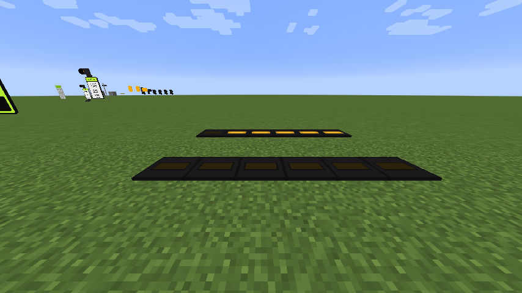

# Crosswalks & APS

Pedestrian signals, push buttons, and the audible units that make a crossing usable without sight.

## Pedestrian signals

CSM has symbolic (hand/person) and worded (DON'T WALK / WALK) crosswalk heads, in 12-inch and
16-inch, on base or pole mounts.

They link to a controller exactly like a vehicle head — hold a signal linker, right-click the
controller, then right-click the crosswalk head. The controller then drives walk, flashing don't
walk and don't walk from the pedestrian timing in its configuration.

| Controller timing | Effect on the crossing |
|---|---|
| Pedestrian walk | How long WALK shows |
| Flashing don't walk | The clearance interval |
| Leading pedestrian interval | Starts WALK before the parallel vehicle green — see [Advanced Mode](advanced-mode-asc3.md#leading-pedestrian-interval-dly-grn) |

## Push buttons

Two families, modelled on the real units:

- **Campbell / PedSafety Guardian** — in yellow and black
- **Polara iN2** — in yellow and black

In **requestable** mode the button is what calls the crossing. In normal mode it registers a
pedestrian call for the next cycle.

## Audible pedestrian signals

The buttons are APS units: they make sound, and what they say depends on what the crossing is
showing.

| Crossing shows | The unit plays |
|---|---|
| Don't walk | A locate tone, once a second |
| Clearance (flashing don't walk) | The locate tone |
| Walk | The walk message |
| Off | Nothing |

**Tweeters** are separate speaker units that chirp only during walk.

### Sound schemes

Each unit has a selectable scheme, so a build can mix the voices you would actually hear in
different cities.

=== "Campbell / PedSafety"

    | Scheme | Walk announcement |
    |---|---|
    | 1 | Standard voice — "Walk sign is on" |
    | 2 | Standard voice — "Warning lights are flashing" |
    | 3 | Standard voice — "Yellow lights are flashing" |
    | 4 | Standard voice — walk sign on, all crossings |
    | 5 | Standard percussive — east–west |
    | 6 | Standard percussive — north–south |
    | 7 | Philadelphia voice — "Walk sign is on" |
    | 8 | Philadelphia voice — "Warning lights activated" |
    | 9 | Philadelphia voice — "Crossing lights activated" |
    | 10 | Philadelphia voice — walk sign on, all crossings |
    | 11 | Audio disabled |

=== "Polara iN2"

    The Polara units carry their own scheme list in the same style, selectable the same way.

### How the sound works

Sound is driven by the server and rendered on the client, so everyone standing at the crossing
hears it correctly from where they are:

- **Hearing range is 10 blocks**, with volume falling off linearly with distance.
- Each unit gets its **own channel**, keyed to its position, so two crossings at one intersection
  do not fight over a single sound slot.
- Sounds play **single-shot** and are re-sent on the next tick, which is what gives the natural gap
  between repeats rather than a seamless loop.

## RRFB

The **rectangular rapid flashing beacon**: two rectangular amber indications in one housing, dark
until a pedestrian activates them, then firing rapid bursts at the traffic. It is the modern device
for an uncontrolled or midblock crossing, where there is no signal to stop anyone.

It links to a controller as a **pedestrian beacon**, exactly as a HAWK does — hold the signal
linker, right-click the controller, right-click the RRFB. Put the crossing's button in
**requestable** mode and the button is what calls it.

The flash is the sequence FHWA Interim Approval IA-21 actually specifies: left, right, left, right,
then **two flashes with both lamps lit**, then a pause, 75 times a minute. An RRFB is not a strictly
alternating wig-wag, which is the detail everyone gets wrong. Every RRFB in a world runs in step, so
a facing pair across a crossing agrees.

Two settings, on the signal head configuration tool: **housing colour**, from the same 16 finishes
as the signal heads, and **single-sided**, which drops the rear lamps for a unit mounted flat
against something.

## In-roadway warning lights

The fixtures set flush into the pavement at a crossing, flashing up and along the road at
approaching drivers. A row of them goes across the approach.

<figure markdown="span">
  { loading=lazy }
  <figcaption>A called row, alternating. Each fixture is a sixteenth of a block tall, so you walk and drive straight over them.</figcaption>
</figure>

They link to a controller like any other signal, and **how they read the controller depends on which
mode you put them in**:

=== "Beacon"

    Linked as a pedestrian beacon, beside an [RRFB](#rrfb) or a HAWK. Dark until the crossing is
    called, then flashing — exactly like the beacon on the post above them.

=== "Crosswalk"

    Linked as an ordinary pedestrian signal at a signalised crossing. Lit through **walk and the
    pedestrian clearance**, and dark on don't-walk.

The difference matters: don't-walk and "not called" are the same colour on the wire, and a row that
lit up on don't-walk would be telling people to cross when they must not.

### Flash pattern

Three, chosen per fixture:

| Pattern | Use it for |
|---|---|
| **RRFB (IA-21)** | A row wired to an RRFB, so the pavement matches the beacon above it |
| **Wig-wag** | A slow alternation — the clearest of the three at a glance |
| **Flash** | A plain one-per-second flash, every fixture together |

**A row alternates on its own.** Each fixture works out which half of the pattern to run from its
own position, so any two placed side by side end up opposite each other — lay a row down in one pass
and it is already right, with nothing to configure and no way to get it wrong.

!!! note "The RRFB pattern looks close to unison"

    That is the standard, not a bug: IA-21 alternates on only a few of its frames and then fires
    both lamps together. Pick **wig-wag** if you want the alternation to be obvious.

## Crosswalk signal rendering

The crosswalk heads are drawn by a renderer rather than a block model, which is what lets a large
family of appearances collapse into a small number of blocks. Body colour, visor, and the symbol
style are properties on the head rather than separate blocks — so changing how a crossing looks does
not mean replacing it.
