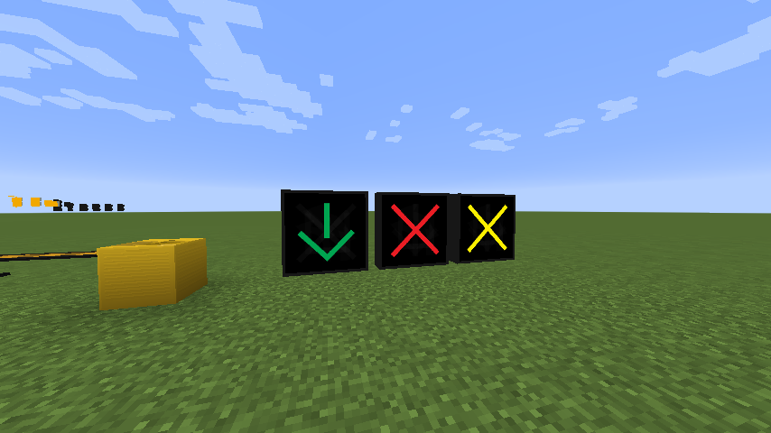
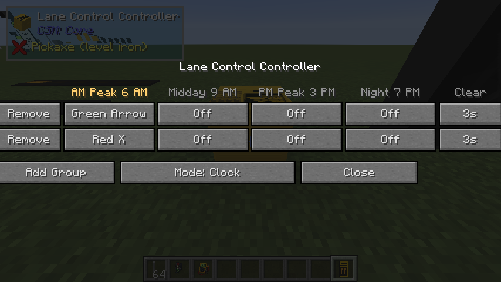

# Lane Control

Reversible lanes and lane-use control: the overhead X and arrow signals, and the cabinet that runs
them off the clock.

<figure markdown="span">
  { loading=lazy }
  <figcaption>A green arrow over an open lane, a red X over a closed one, and a yellow X over one that is closing. The yellow cabinet on the left is the lane control controller.</figcaption>
</figure>

## The signals

One block, eight aspects, hung over the lane it controls:

| Aspect | Means |
|---|---|
| **Green arrow** | The lane is open in your direction |
| **Red X** | The lane is closed |
| **Yellow X** | The lane is closing — get out of it |
| **Yellow left / right arrow** | Merge that way |
| **Shared turn**, **Turn** | Turning uses |
| **Off** | Dark |

Right-click a signal to set its aspect, body and visor colour, visor type, mount and tilt by hand.
A signal that belongs to no group keeps whatever you set, indefinitely — you do not need a
controller unless you want the lane to change on its own.

## The controller

The controller is a separate cabinet, not a mode on the traffic signal controller. A reversible lane
is a **clock** decision, not a phase one, and the two share no machinery — so lane control gets its
own block, in its own yellow livery, and you never have to stand up an intersection to get a
reversible lane.

<figure markdown="span">
  { loading=lazy }
  <figcaption>Two groups against the four slots. The highlighted column is the slot the clock has selected right now; each cell cycles through the aspects.</figcaption>
</figure>

### Groups

A **group** is a set of signals that change together, plus the aspect it shows in each of the four
time-of-day slots and a clearance interval. The group, not the signal, is the unit you configure —
a reversible lane is every signal over that lane, and half a lane changing direction is not
something anyone wants to be able to express.

A signal can be in **one group only**. Linking it to a second removes it from the first, because two
groups pushing different aspects at the same signal would just fight.

### Setting one up

**1. Place the controller** somewhere near the lanes. Right-click it and press **Add Group** once
per lane group you want.

**2. Set each group's aspects** — one cell per slot. `Off` leaves those signals dark in that slot.

**3. Link the signals.** Hold the **Signal Link Tool**:

- Right-click the **controller** to select it. It reports which group you are linking into.
- **Sneak-click the controller again** to step to the next group.
- Right-click each **signal** to add it to the selected group. Sneak-click a signal to unlink it.

!!! warning "Holding the link tool stops both blocks opening their screens"

    That is deliberate — otherwise the configuration GUI would open over the top of every attempt
    to link, and the tool would look broken.

**4. Set the schedule** if the default hours do not suit. The four slots are the same ones the
traffic signal controller uses for its
[coordination patterns](advanced-mode-asc3.md#four-patterns-on-a-clock), so a corridor's signals and
its reversible lanes change over at the same moment.

### The clearance

Closing a lane is not instantaneous. When a group's aspect changes away from an open lane, the
controller shows **YELLOW X first**, holds it for the group's clearance interval (three seconds by
default), and only then shows the new aspect.

**Opening a lane does not wait**, because there is nobody in it to warn. That asymmetry is the one
piece of real signal timing in this block.

### Running it by hand

**Mode: Clock** follows the schedule. Click it to hold a single slot instead — for an incident, a
closure, or just to see what the PM peak looks like at ten in the morning. Real systems can be
driven by hand, and without it the block would only ever be a clock.

## See also

- [Traffic Signals](traffic-signals.md) — the intersection controller, and the link tool these
  signals share with it.
- [Advanced Mode (ASC-3)](advanced-mode-asc3.md) — the same four time-of-day slots, driving
  coordination patterns.
- [Traffic Accessories](../reference/traffic-accessories.md) — both blocks in the reference.
