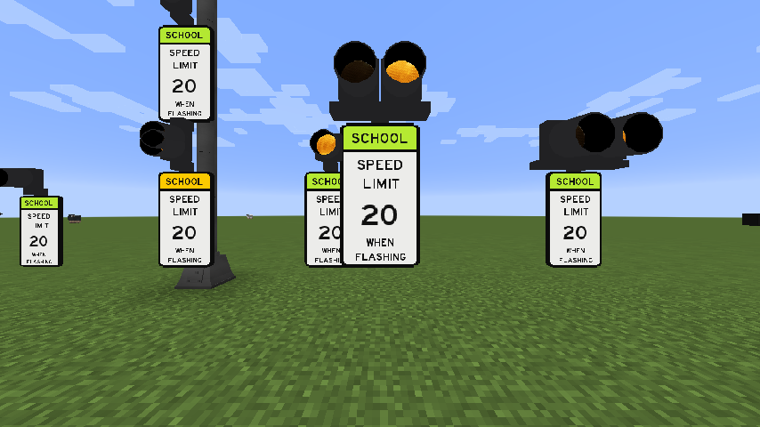
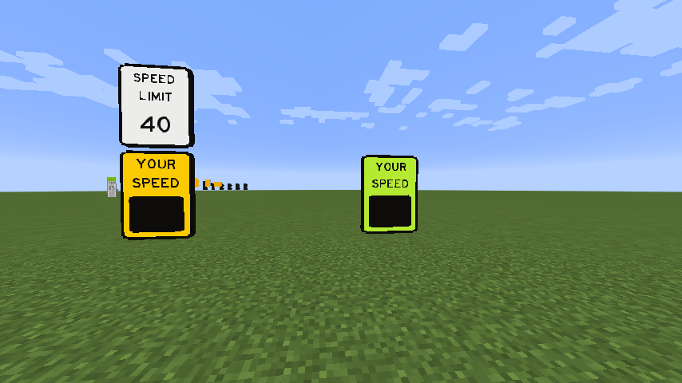
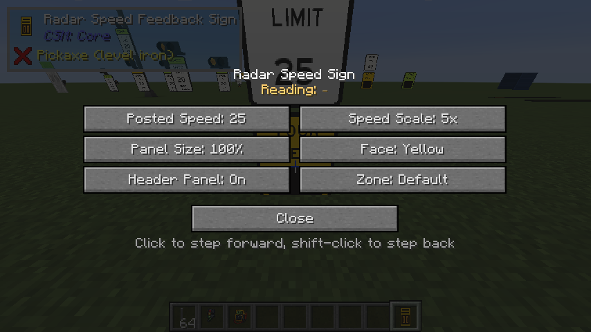

# Message & Speed Signs

Signs whose legend you set in game, and which change while the world is running.

Most of them are yours to set. Two are not: the **school zone beacon** answers to the world clock,
and the **radar speed feedback sign** answers to whatever is moving in front of it.

## Portable changeable message sign (PCMS)

The trailer-mounted amber board you see at roadworks. Right-click to edit.

| | |
|---|---|
| **Pages** | Up to 8 |
| **Each page** | 3 lines, up to 16 characters each |
| **Cycle speed** | In seconds, between pages |
| **Trailer colour** | Orange, yellow, black, silver, white |
| **Flashers** | Two 8-inch beacons — off, on, or none |
| **Angle** | The board rotates on its trailer |

## Overhead gantry DMS

The three-line amber board over freeway lanes. Same page model as the PCMS — up to 8 pages of three
16-character lines with a cycle speed — but on a large fixed housing rather than a trailer.

Its collision is a single block; the housing it draws is far bigger, roughly nine blocks wide, so
place it in the middle of the gantry span and let the sign overhang.

## Variable speed limit signs

Two of them, sharing a display.

=== "Portable trailer"

    A standard MUTCD **SPEED LIMIT** panel with the number on an LED screen below the static
    legend, on a mast above a tow trailer with outriggers, wheels and two beacon flashers.

    | Setting | Range |
    |---|---|
    | Speed | **20–95** (default 35) |
    | Flashers | None, off, or on |
    | Trailer colour | Orange, yellow, black, silver, white |

    Collision is the low trailer footprint, so you can walk right up to it; the mast and sign are
    drawn upward from there.

=== "Overhead gantry"

    The same **SPEED LIMIT** legend over a large LED number, in a fixed housing with no trailer or
    flashers. Full-block collision.

    It adds one setting of its own: **full screen**, which drops the static legend and gives the
    whole housing over to the number.

## School zone beacon assembly

A SCHOOL SPEED LIMIT sign with amber beacons that flash during the hours the zone is posted for —
and only then. Nothing about it needs wiring: it reads the world clock.

<figure markdown="span">
  { loading=lazy }
  <figcaption>Both permitted plaque colours, three beacon arrangements, and the panel scale from 75% to 200%. The beacons wig-wag rather than blinking together.</figcaption>
</figure>

The face is a real assembly's: a **white regulatory sign** under a coloured **SCHOOL plaque**. The
white stays white; the plaque is yours to choose (see [Sign face colour](#sign-face-colour) below).

| Setting | Choices |
|---|---|
| Posted speed | 5–45, in fives |
| Panel size | 75 / 100 / 125 / 150 / 200% |
| Beacons | One above and one below · One above · Two above |
| Beacon size | 8 inch or 12 inch |
| Plaque colour | Yellow or fluorescent yellow-green |
| Mode | Off · Scheduled · Always on |
| Schedule | AM start/end and PM start/end, in whole hours |

**Two windows, because that is what a real school zone posts** — one around arrival, one around
dismissal. Hours run 0–23 on the world clock, which starts its day at 06:00. A window whose end is
at or before its start **wraps past midnight**, so 22 → 02 works the way it reads; a window with
its start and end on the same hour is **off**, not on all day.

!!! tip "Beacons that are correctly dark look exactly like beacons that are missing"

    `/time set` does not stop the clock, so a posted window can lapse between setting the time and
    looking at the sign. Freeze it with `/gamerule doDaylightCycle false` first, then a lit lamp is
    unmistakable.

The beacons are the traffic signal system's own signal sections, which is why you can pick 8 or 12
inch — and why they look like the heads on the poles beside them. The assembly draws no post of its
own, so it mounts on whatever pole you put behind it.

## Radar speed feedback sign

The **YOUR SPEED** board that reads an approaching vehicle and shows its speed back to it. It is
the only sign here that measures anything, and the only one with a redstone output.

<figure markdown="span">
  { loading=lazy }
  <figcaption>Both face colours, one with the optional SPEED LIMIT header panel above it. The board is dark because nothing is moving in the zone — it lights as a vehicle approaches and blanks about three seconds after the zone clears.</figcaption>
</figure>

### What it shows

| While | The board shows |
|---|---|
| Nothing in the zone (for ~3 s) | Nothing |
| At or under the posted speed | The speed, steady |
| Over the posted speed | The speed, flashing |
| More than 15 over | `SLOW DOWN`, flashing |

With several vehicles in the zone it shows the **fastest**, the way a real radar reads the
strongest return. It emits a **full redstone signal while the reading is over the posted speed**,
so it can drive a beacon, a camera, or anything else you like.

### Speed, and the multiplier

The number is the same one the SUM mod's speed HUD would print for the same journey — deliberately,
so a sign and that HUD never disagree. Read literally, though, **nothing in Minecraft moves at road
speed**: a sprinting player covers about 12.5 mph, so a realistically posted 25 mph zone would never
once be exceeded.

That is what the **speed scale** is for. It defaults to **1x** — true to the HUD — and goes up to
5x for anyone who would rather their traffic behaved like traffic. At 5x a sprinting player reads
about 63.

<figure markdown="span">
  { loading=lazy }
  <figcaption>Right-click the sign to configure it. Click a button to step forward, shift-click to step back.</figcaption>
</figure>

### The scan zone

A freshly placed sign works straight away: it watches a box reaching **12 blocks out in the
direction it faces**, about three wide. To set your own, hold the **Sensor Zone Tool** and click
two opposite corners — the same tool, and the same two-click flow, as a signal detector zone.

!!! warning "Hold the tool, and the sign will not open its GUI"

    That is deliberate. A block's right-click runs before the item's, so the sign steps out of the
    way while the zone tool is in your hand — otherwise the configuration screen would open over
    the top of every attempt to program it.

Players and villagers count as vehicles; nothing else does. It measures horizontal movement only, so
falling past a sign does not register as speeding.

## Sign face colour

The school zone plaque and the radar sign's face take the same setting, and it is not a palette:
the MUTCD permits a warning sign face to be **standard yellow** *or* **fluorescent yellow-green**,
the same choice it permits on crosswalk signs, and both are in service. Those two, and nothing else.

## Placing them

All of them are in the [Traffic Accessories](../reference/traffic-accessories.md) reference. Because
the housings are much larger than the blocks that own them, leave room:

| Block | Roughly |
|---|---|
| Overhead DMS | 9 wide × 5 tall × 5 deep |
| Portable speed limit | 9 wide × 7 tall × 9 deep |
| Overhead speed limit | 5 wide × 7 tall × 5 deep |
| School zone beacon | 1 wide × 3–5 tall, on your own pole |
| Radar speed sign | 1 wide × 2–4 tall, on your own pole |
