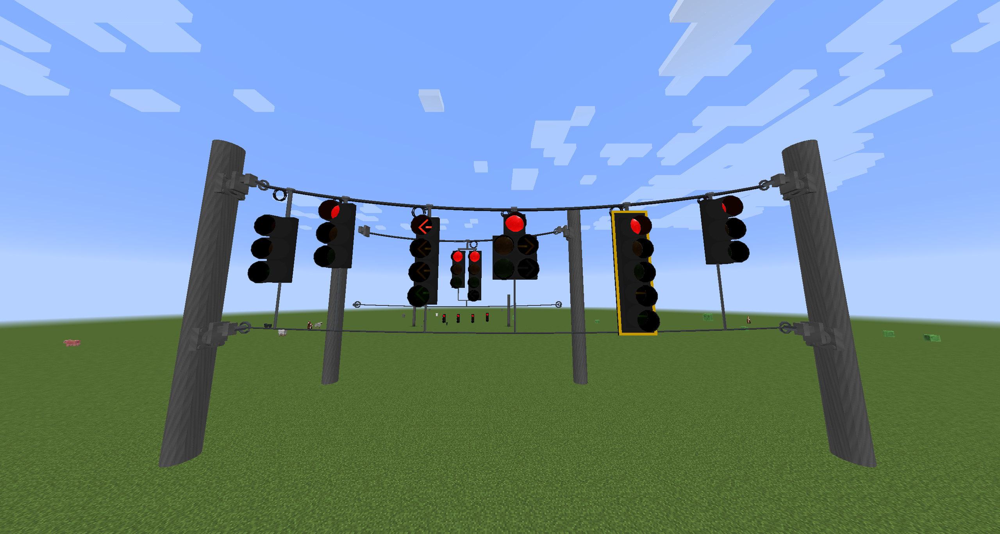
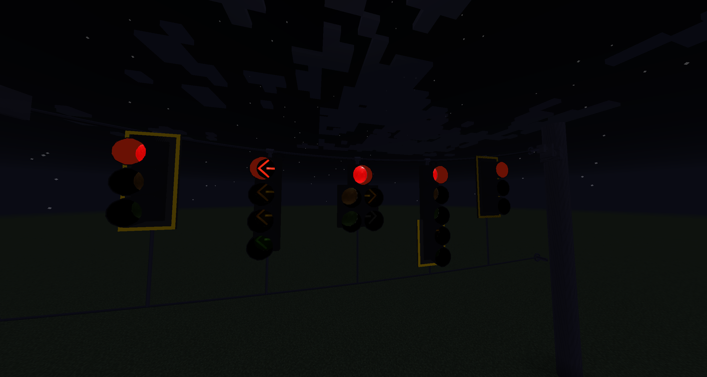
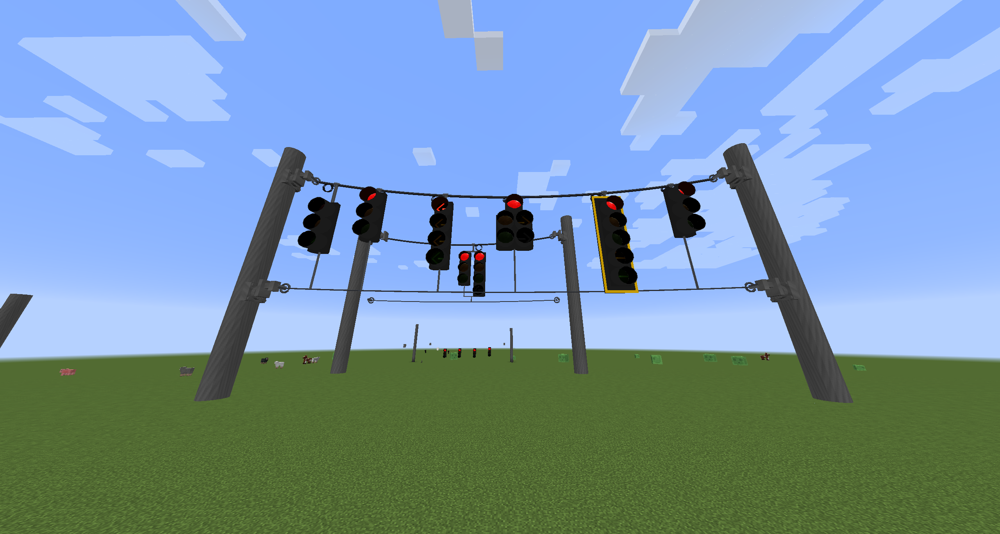
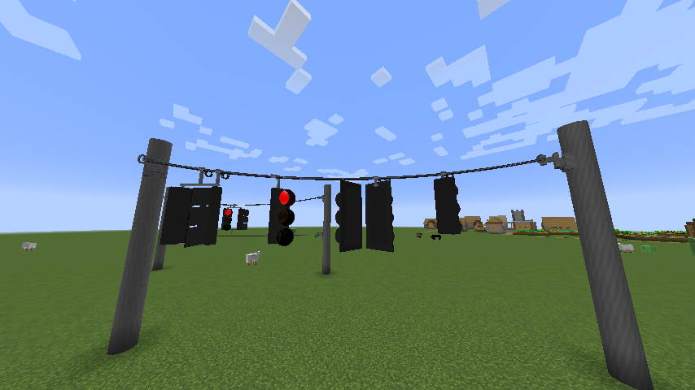
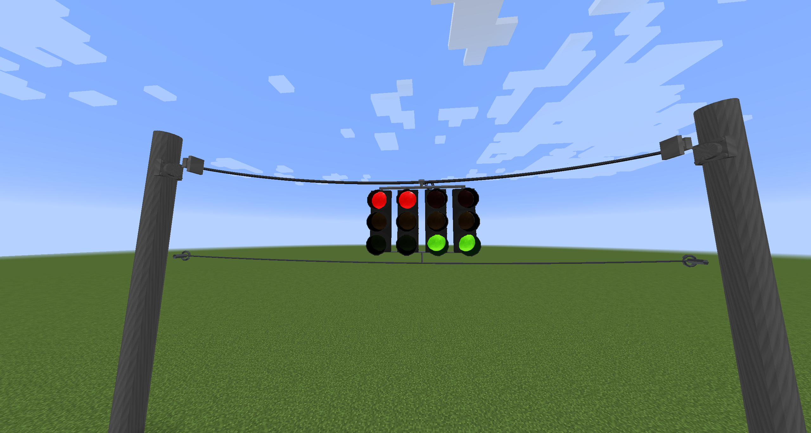
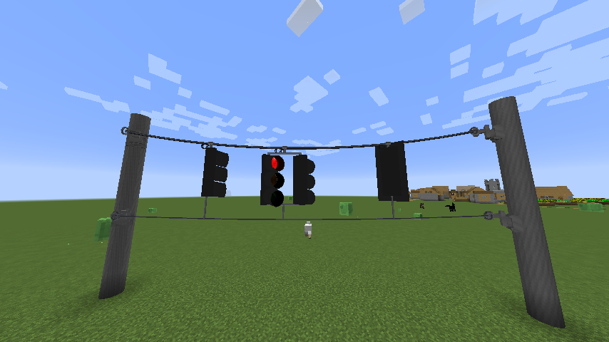

# Span Wire

A messenger cable strung between two poles, with signals hanging from it at the height the cable
actually reaches — not at whatever height the block grid happens to offer.

## Setting up a signal on a span

Build it in this order. **Mounts must exist before you string**, because a span adopts the mounts
it can find at the moment it is strung.

<figure markdown="span">
  { loading=lazy }
  <figcaption>A finished box span. Six assemblies of different depths on one wire, the tether passing under all of them.</figcaption>
</figure>

**1. Put up two poles.** Anything works; the demos use vertical traffic poles. Leave enough height
that the mounts can sit a block or two below the anchors — the cable sags away from the line
joining them, so a mount level with the anchors ends up *above* the cable everywhere in between.

**2. Place a Span Wire Anchor** near the top of each pole, on the side facing the other pole.

**3. Hang your mounts** under where the cable will run:

- **Wire Mount** — one signal head.
- **Signal Cluster Mount** — two to four heads on one bracket.

**4. Put the signal heads in place**, in the block directly below each mount. For a cluster, in the
blocks under the columns the bracket covers.

**5. Take the Span Wire Tool** and right-click one anchor, then the other. The tool reports what it
found:

```
Span wire anchored at (-192,11,-1476). Click the far anchor to string it.
Span strung: 4 hangers, 0.85 block sag at midspan.
```

**Read the hanger count.** That is how many mounts the span adopted. If it is lower than the number
of mounts you placed, one of them is not under the wire — check its height.

!!! tip "Adding a mount later means re-stringing"

    A *mount* added to a finished span sits under the wire unattached until you right-click both
    anchors again. Adding or removing **signal sections** is different — the span notices those on
    its own and re-hangs its tether to suit, with no re-string.

**6. Optionally, add a lower tether** — see [The box span](#the-box-span) below.

### Aiming the heads

Each head keeps its own facing, so aim them individually with the Signal Head Configuration Tool.
Nothing about the span forces heads to agree, which is the entire point of a diagonal crossing an
intersection with approaches on several sides.

### Wiring them up

The cable is **decoration**. It carries no power and no signal. Link the heads to a controller
exactly as you would on a pole or a mast arm — see [Traffic Signals](traffic-signals.md).

## What you get

Signals **rise to meet the cable** rather than sitting on their block. The cable is solved as a real
catenary, so a head near midspan hangs lower than one near an anchor, and the hardware follows: a
mast down to the housing, a clamp on the messenger, a saddle, and the coiled slack conductor with a
pigtail running back into the mast.

Backplates follow their head, so a plate stays framed around a signal that has risen, and their
retroreflective bands pick up light after dark the way the real tape does.

<figure markdown="span">
  { loading=lazy }
  <figcaption>The same hardware after dark. The bands are drawn as retroreflective rather than lit, so they read without turning the plate into a lamp.</figcaption>
</figure>

## Stacked signals and add-ons

A signal is often more than one block: a three-section head with a single-section add-on bolted
under it, a doghouse main over its secondary, a through head with a double-arrow add-on a block
below across a gap. Build these exactly as you would on a pole — the span treats the whole stack as
one signal.

<figure markdown="span">
  { loading=lazy }
  <figcaption>Seen from underneath. The tether hangs below the <em>deepest</em> assembly on the span, and every head gets a tie down to it — long ones for the short heads, short ones for the tall.</figcaption>
</figure>

- The whole stack **rises together** onto the cable. Sections stay bolted to their head.
- A box span's tether measures itself against the **deepest** assembly on the span, so it passes
  under all of them rather than through the tallest.
- **Add or remove a section at any time.** The span re-measures and re-hangs its tether without
  being re-strung.

!!! note "How far a stack can reach"

    Two blocks below the head under the mount — which covers an add-on bolted straight on, or one a
    block down across a doghouse gap. A body further away than that does not ride up onto the cable
    with the rest, so it is not treated as part of the assembly either.

## Diagonals

<figure markdown="span">
  { loading=lazy }
  <figcaption>A 45° span. The heads on it face independently — each one is aimed at its own approach, not at the cable.</figcaption>
</figure>

Spans do not have to run along an axis. A cable strung across an intersection at 45° works, and the
hardware follows it: the clamp sits square to a skewed messenger, cluster brackets run along the
cable rather than along a block axis, and heads on it can face **any direction independently** —
which is the whole point of a diagonal crossing an intersection with approaches on several sides.

## Clusters

<figure markdown="span">
  { loading=lazy }
  <figcaption>A cluster carrying two heads that face opposite ways, on one bracket under one mast, tied at the bottom.</figcaption>
</figure>

A Signal Cluster Mount carries two to four heads from one point, on a horizontal bracket under a
single mast.

- Heads on a cluster **need not face the same way.** A cluster covering a side road and a main
  approach is a real arrangement and is what a cluster is for.
- The bracket runs **along the cable**, and the mast comes down at the middle of it.
- Heads on a bracket hang **level with each other** rather than each tracing the cable, because a
  bracket is rigid.
- A thin tie bar joins the bottoms of the housings, which is what stops them swinging
  independently. On a box span, one drop runs from the middle of that bar down to the tether — the
  heads are already tied to each other, so the assembly hangs from the wire at one point rather
  than at every housing.
- Heads of **different depths** are handled: the bar runs under the deepest one so it clears every
  housing, and any shorter head gets a short leg down to meet it.

Cluster width is set from the mount's options screen. Coverage is centred on the mount, and the
bracket trims itself to the columns that actually hold something — an empty cluster does not reach
into thin air.

## The box span

<figure markdown="span">
  { loading=lazy }
  <figcaption>A box span on a diagonal run — messenger above carrying the weight, tether below holding the heads square.</figcaption>
</figure>

A second, lower tether cable running parallel to the messenger, tying the bottoms of the heads
together. Real installations use one to stop heads twisting in wind.

Turn it on from **any mount's options screen** — it is a property of the whole span, not of one
mount.

Place a second pair of anchors lower on the same poles and the tether dead-ends on them, at the
height you put them. You can add them before or after stringing; the span picks them up as soon as
the pair exists. Without them the tether hangs at a height derived from what is on the span, which
is the fallback rather than the intent.

!!! warning "Anchors override the automatic height"

    Lower anchors say *put the tether here*, and the span obeys. Place them too high for the
    tallest assembly on the wire and the tether will cut through it. Either lower the anchors, or
    remove them and let the span work the height out for itself.

The tether is strung far tighter than the messenger, because the messenger carries the weight and is
allowed to sag while the tether only has to stop things turning.

## The mount options screen

Right-click a mount with anything other than the Span Wire Tool:

| Setting | What it does |
|---|---|
| **Mount Style** | Flush to the wire, or an extending mast |
| **Conductor Coil** | None, one side, or both sides |
| **Signal Side** | Shifts the whole span sideways so it lines up over the signal housings, which do not sit on their blocks' centre lines. Auto follows the signals |
| **Lower Tether** | None, or box span |
| **Cluster Width** | Two to four. Only shown on a cluster mount |

## Things worth knowing

- **The cable is purely visual.** It carries no power and has no collision. Signals are wired the
  way they always were.
- **There is no Immersive Engineering dependency.** The span wire is CSM's own implementation.
- **A back-guy is optional**, not automatic. Nothing runs from a pole to the ground unless you put
  it there.
- **A mount above the cable draws nothing.** That is a placement error being reported rather than
  hidden — move the mount below the wire.
