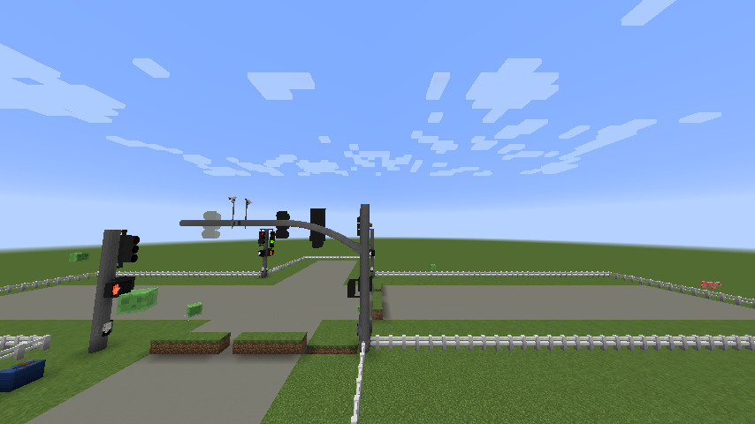

# Traffic Signals

Signals in CSM are not decoration that cycles on a timer. A **controller** drives them, with real
phases, minimum and maximum greens, clearance intervals, and a conflict monitor that faults the
intersection if it is ever asked to show two conflicting greens.

## Building an intersection

<figure markdown="span">
  { loading=lazy }
  <figcaption>A four-way running under one controller: through heads out on a curved mast arm, pedestrian signals on the corners.</figcaption>
</figure>

1. **Place a controller cabinet** somewhere near the intersection.
2. **Place your signal heads** on poles, mast arms or a span wire.
3. **Take the Signal Link Tool.**
4. **Right-click the controller** to select it. This stores the controller and defaults you to
   circuit 1.
5. **Right-click each signal head** to link it to that circuit. Sensors, crosswalk signals and APS
   buttons link the same way.
6. **Sneak-click a linked device** to unlink it again.

Then use the **Traffic Signal Configuration Tool** to change timings and behaviour after linking.

!!! tip "Changing circuits as you go"

    A circuit is one approach. To start the next one, **right-click any ordinary block** with the
    Signal Link Tool: it steps to the next circuit and tells you which, marking it `(new)` when you
    have gone past the circuits that already exist. So the usual rhythm is controller, then one
    approach's heads, then a block of dirt, then the next approach's heads.

    You never tell it *which* movement a head serves — the controller reads that from the head
    itself, so a left-turn head lands in the circuit's left list and a right-turn head in its right
    list.

    A sensor's detection zone is a separate matter, set with the **Sensor Zone Tool**.

## Operating modes

A controller runs in one of these:

| Mode | What it does |
|---|---|
| **Normal** | Full coordinated operation, with minimum and maximum green timing |
| **Flash** | Alternating yellow/red flash |
| **Requestable** | Sits idle until a sensor or push button asks, then services the request |
| **Ramp meter** (full or part time) | Meters vehicles onto a freeway ramp |
| **Wrong way detection** | Runs a WWVDS beacon system rather than a signal |
| **Manual off** | Everything dark |
| **Forced fault** | All-red flash, because a fault was detected |
| **Advanced** | NEMA dual-ring, dual-barrier phase control — see [Advanced Mode](advanced-mode-asc3.md) |

Sneak-click the controller to step to the next mode; it tells you which one it landed on.

!!! tip "Cycling past an unprogrammed Advanced"

    Advanced is last in the cycle, so sneak-clicking round the modes lands on it on the way back to
    Flash — and an Advanced controller with no phase plan programmed faults immediately. Landing
    there says the plan needs programming and that the next sneak-click moves on, and that one
    fault does not block the mode change, so you are never stuck on it.

    Every other fault still holds the controller until you clear it with the Signal Configuration
    Tool — the conflict monitor's skipped-clearance fault above all.

## Timing

Every time is in ticks, and 20 ticks is a second.

| Parameter | Default | What it is |
|---|---|---|
| Yellow | 80 (~4s) | Yellow duration |
| All red | 60 (~3s) | All-red clearance between movements |
| Flashing don't walk | 300 (~15s) | Pedestrian clearance |
| Minimum green | 300 (~15s) | Shortest green on the main movement |
| Maximum green | 1400 (~70s) | Longest green on the main movement |
| Minimum green (secondary) | 140 (~7s) | Shortest green on the side street |
| Maximum green (secondary) | 1000 (~50s) | Longest green on the side street |
| Pedestrian walk | 160 (~8s) | Minimum walk indication |
| Leading pedestrian interval | 0 (off) | Walk starts this far before the parallel vehicle green |

## The conflict monitor

Real cabinets carry a malfunction management unit that watches the signal outputs and drops the
intersection to flashing red if it sees something that could kill someone. CSM has one.

!!! danger "A signal never goes green to red without a yellow"

    In Normal and Advanced mode, a movement showing green or a flashing yellow arrow **always**
    gets its yellow before it gets red. If the controller is ever asked to skip that, the MMU
    faults the intersection into all-red flash rather than doing it.

    Ramp meters are the deliberate exception — metering signals legitimately drop straight to red.

If your intersection drops into flashing red and stays there, that is the MMU telling you the phase
plan asked for something unsafe, not a rendering bug.

## Wrong way detection

Modelled on TAPCO-style wrong-way vehicle detection. Each circuit runs independently:

1. Sensors poll twice a second for entities in their detection zone.
2. An entity's distance to the sensor is tracked over time. Getting **closer** counts as wrong-way
   approach travel.
3. An entity has to accumulate **at least three blocks** of approach before it triggers anything,
   so someone flying past the zone does not set it off.
4. On trigger, the circuit's **beacons** go active.
5. Beacons hold for **30 seconds** after the last confirmed approach, then drop.

**Setting it up:** link one or more sensors per circuit — several lets you cover a curve or layer
the detection — and link beacons to the same circuit. Place sensors at the *wrong way end* of the
road, because the sensor block is the reference point and the system is looking for things moving
toward it.

## Configuring a head

Signal heads carry their own appearance, independent of the controller. With the **Signal Head
Configuration Tool**, sneak-click to change mode and click a head to apply it:

| Setting | Options |
|---|---|
| Body / door / visor colour | The usual highway colours |
| Visor type | Full, cap, tunnel and so on |
| Body style | Housing generation |
| Bulb style and type | Incandescent, LED, dotted LED |
| Body tilt | None, left/right tilt (22.5°), left/right angle (45°) |
| Mount type | How it attaches to what carries it |
| Nudge forward/back, left/right | Fine placement, a sixteenth of a block at a time |

Backplates follow the head automatically — tilt a head and its plate tilts with it. Every plate
family comes in the usual colour pairs — black with a yellow, white, blue, pink or green
retroreflective band, or the reverse — plus gray and an all-yellow plate whose whole front is
retroreflective. Green is bike-lane green, for plates on bicycle signals.

## Where signals can hang

- **Poles and mast arms** — see [Mast Arms](mast-arms.md) for the multi-block curved arms.
- **Span wire** — see [Span Wire](span-wire.md).
- **Pedestal bases**, for crosswalk signals and low-mounted heads.

### Pole finials

A pedestal pole's top can wear a decorative **Pole Finial** — Small Ball, Large Ball, Acorn,
Fluted Urn, Spire or Flat Cap. It is a block of its own, placed on top of the pole, and it takes
the pole's own colour, so a repaint of the post repaints the ornament with it.

The **Street Light Configuration Tool** is the quicker way: right-click anywhere on an upright
pedestal pole and it fits, swaps or removes the finial on the top of that stack, so a tall post can
be styled from the ground. Sneak-right-click changes the tool's mode, the same as the other
configuration tools.

A finial only fits an **upright pedestal pole** — its collar is cut to that tube, and it pops off
as an item if the pole below it goes.

## Related

- [Advanced Mode (ASC-3)](advanced-mode-asc3.md) — ring-barrier phase plans, overlaps, preemption
- [Crosswalks & APS](crosswalks-and-aps.md) — pedestrian signals and audible units
